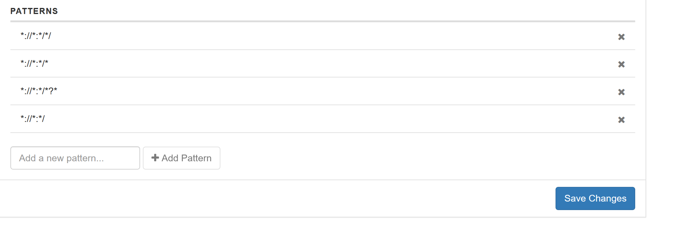
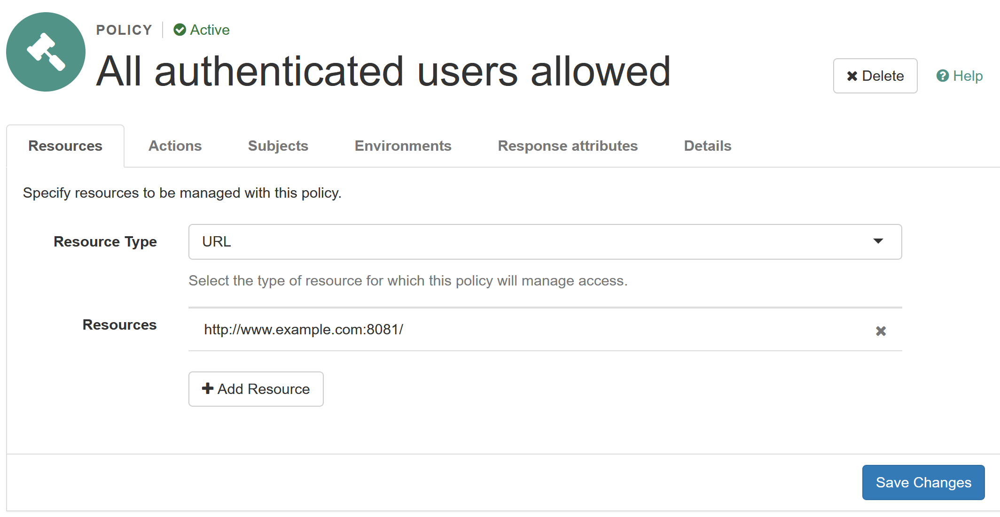
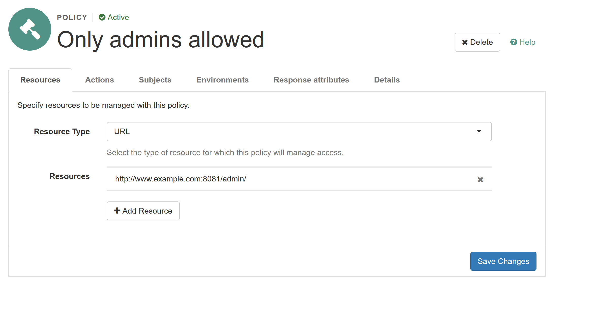
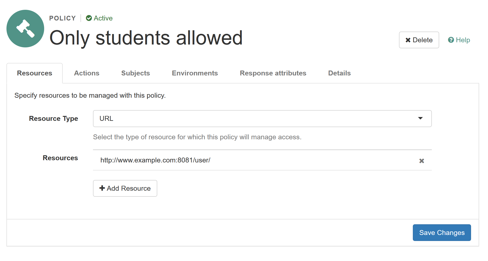
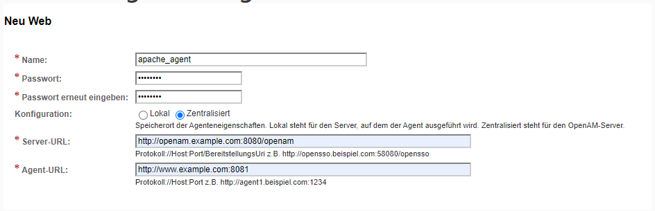
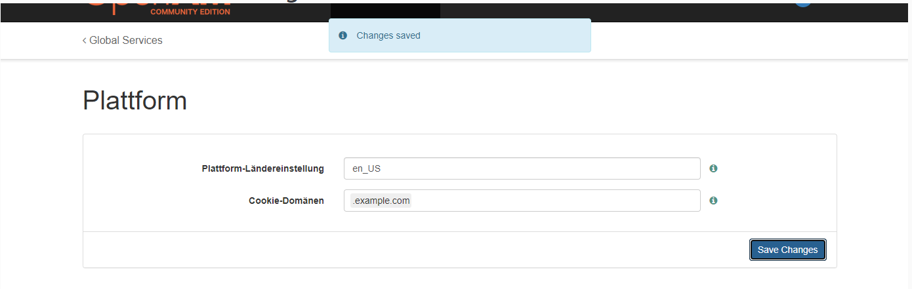
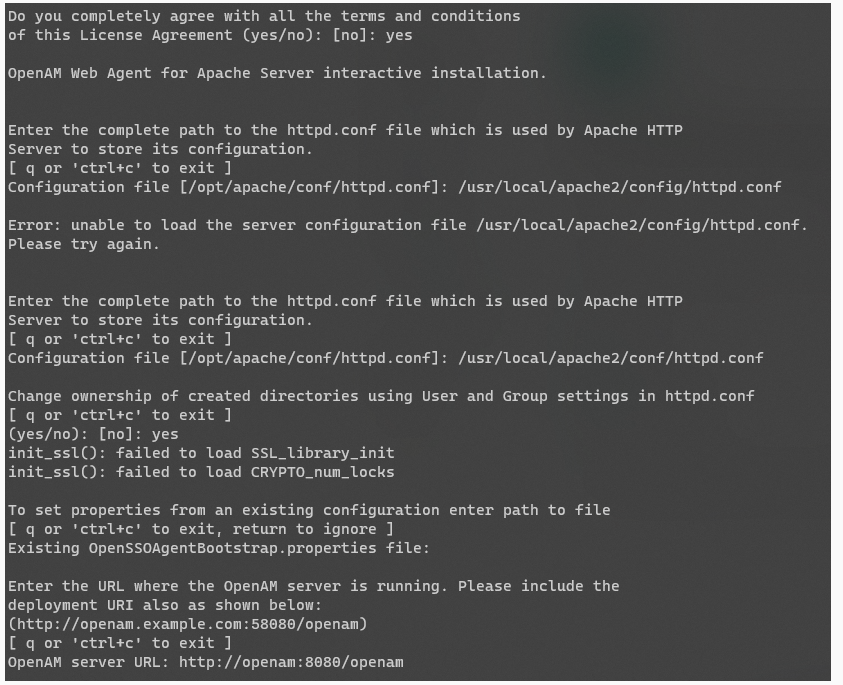
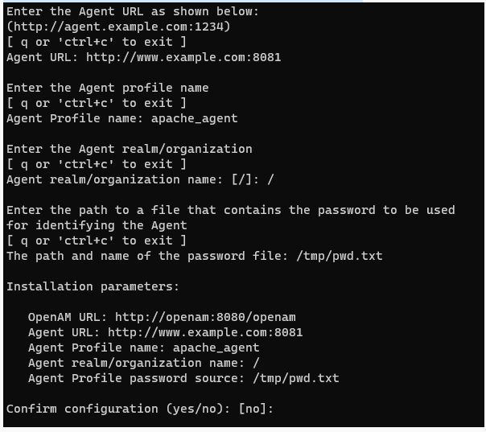

1. Adjust host file of your machine by adding the line:

```
127.0.0.1 openam.example.com www.example.com
```

2. Start docker network:

```
docker-compose up -d
```

3. Access openam.example.com:8080/openam

- create default configuration
- login (user: amadmin)
- realm -> authorization -> resource types: add two additional resource patterns



- realm -> subjects: add two users and two groups (admin/student), assign one user to each group


- realm -> authorization -> policies: add 3 policies



-> use GET and POST for actions, and adjust the subjects section for the different policies.


- realm -> applications -> web agent: configure web agent for the apache application


password = password

- configure -> global policies -> platform -> cookie domain: change cookie domain

- 
4. Configure Apache Web Agent

- open an interactive shell inside the apache_agent container:

```
docker exec -it apache_agent /bin/bash
```
- start the installation process from the shell inside the container:
```
cd /usr/web_agents/apache24_agent/bin/
./agentadmin --i
```

- configuration of the web agent:





5. Restart the apache_agent container
6. Visit http://www.example.com:8081 (possible with any authenticated user)
7. Visit http://www.example.com:8081/admin (possible with user belonging to admin group)
7. Visit http://www.example.com:8081/user (possible with user belonging to student group)


